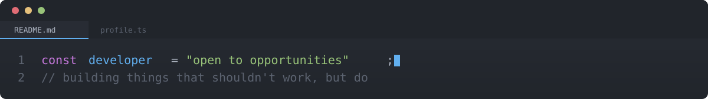
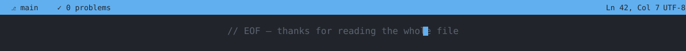

<!--
  ============================================================
  Photo lives at photo.png in the repo root — all image files
  (photo.png + 4 svgs) sit at the top level of this repo, no
  assets/ subfolder needed.

  GitHub username and LinkedIn are already filled in.
  Still need: YOUR_WEBSITE → your portfolio site URL
  (or say the word and I'll drop that link entirely)
  ============================================================
-->

<div align="center">
  
  <br />
  <br />
  <table>
    <tr>
      <td align="center" width="160">
        
      </td>
      <td valign="middle">
        <h2>Jagan Mohan Dash</h2>
        
      </td>
    </tr>
  </table>
  <br />

  [](mailto:jagnsuvhamohan@gmail.com)
  [](https://github.com/jagnCoder)
  [](https://linkedin.com/in/jagan-mohan-dash)
  [](https://jagncoder.github.io/Portfolio/)

  
</div>


## `// ABOUT`

```diff
+ Actively building a strong foundation in core CS & engineering principles
+ Led teams across multiple hackathons — front, back, and prompt layers
+ Exploring cybersecurity: pentesting, threat hunting, cryptography, networking
+ Open to internships and real engineering problems
- Not interested in tutorials that never ship
```


## `// STACK`


<table>
<tr>
<td valign="top" width="33%">

**languages**

```

python
javascript
sql

```

</td>
<td valign="top" width="33%">

**frontend**

```

react
vite
html / css

```

</td>
<td valign="top" width="33%">

**backend**

```

python
sqlite
supabase
tcp/ip sockets

```

</td>
</tr>
<tr>
<td valign="top" width="33%">

**security**

```

pentesting
network security
threat hunting

```

</td>
<td valign="top" width="33%">

**ai / prompting**

```

prompt engineering
generative ai

```

</td>
<td valign="top" width="33%">

**deploy / tools**

```

render
github pages
docker
postman
git
linux

```

</td>
</tr>
</table>


## `// SKILLS`

```text
Python                 ████████████████░░░░  80%
React / Vite           ███████████████░░░░░  75%
SQL / SQLite           ██████████████░░░░░░  70%
Networking (TCP/IP)    ██████████████░░░░░░  70%
Cybersecurity          █████████████░░░░░░░  65%
UI / UX                ███████████████░░░░░  75%
```


## `// PROJECTS`

<details open>
<summary><b>neighborhood-helpboard</b> — TCP client-server app</summary>

```yaml
description: Local neighborhood communication over a modular Python codebase
features:
  - TCP client-server architecture
  - LAN accessibility
  - Secure onboarding workflows
  - Deployed live on Render
```
[`→ live`](https://neighbour-helpboard.onrender.com/) · [`→ source`](https://github.com/jagnCoder/neighborhood-helpboard)
</details>

<details>
<summary><b>portfolio-site</b> — React + Vite portfolio</summary>

```yaml
description: Responsive personal portfolio with interactive skills/project showcase
features:
  - Polished UI/UX grids and charts
  - Published via GitHub Pages
```
[`→ live`](https://jagan-mohan-dash.netlify.app/) · [`→ source`](https://github.com/jagnCoder/portfolio)
</details>

<details>
<summary><b>color-guessing-game</b> — Interactive browser game</summary>

```yaml
description: Fun and responsive RGB color matching game built with vanilla web technologies
features:
  - Dynamic RGB color generation
  - Interactive difficulty levels and score tracking
  - Clean UI with smooth transitions
```
[`→ live`](https://color-guessing-game-by-jagn.netlify.app/) · [`→ source`](https://github.com/jagnCoder/Jagn-html-games)
</details>


<details>
<summary><b>flight-management-system</b> — Console app + SQLite</summary>

```yaml
description: Passenger registration, booking, search, and cancellations
stack: [Python, SQLite]

```

[`→ source`](https://github.com/jagnCoder/Python-OOP-and-DB-Foundations/tree/main/Database_Connectivity/flight%20Project%20with%20SQLite)
</details>


<details>
<summary><b>Hotel-management-system</b> — Console based Automated booking system</summary>
  
```yaml
description: Room booking, billing, and availability tracking
stack: [Python, SQLite]

```

[`→ source`](https://github.com/jagnCoder/Python-OOP-and-DB-Foundations/tree/main/Database_Connectivity/Hotel%20Management)
</details>


<details>  
<summary><b>Retrive-Train-Details</b> — Console based Database look-up</summary>

```yaml
description: Fast lookup and display of train information
stack: [Python, SQL]

```

[`→ source`](https://github.com/jagnCoder/Python-OOP-and-DB-Foundations/tree/main/Database_Connectivity/Retrive%20Train%20Details)
</details>


<details>
<summary><b>Update account Balance</b> — banking Utility Script + Console app</summary>
  
```yaml
description: Secure balance modification and transaction logging
stack: [Python, SQLite]

```

[`→ source`](https://github.com/jagnCoder/Python-OOP-and-DB-Foundations/tree/main/Database_Connectivity/Update%20account%20balance)
</details>


## `// EDUCATION`

```
Bachelor of Technology — Computer Science and Engineering
Aryan Institute of Engineering and Technology (AIET), Bhubaneswar
CGPA: 8.5
```


## 📜 CERTIFICATIONS
- [x] [Introduction to Generative AI (Google Cloud)](https://www.coursera.org/account/accomplishments/verify/UHBM09A7OVUS)
- [x] [Introduction to Cybersecurity Tools & Cyberattacks (IBM)](https://www.coursera.org/account/accomplishments/verify/WY0R7EITQAM1)
- [x] [Introduction to Web Development with HTML, CSS, JavaScript (IBM)](https://www.coursera.org/account/accomplishments/verify/MRBX1J6RRQ0Y)
- [x] [Getting Started with Git and GitHub (IBM)](https://www.coursera.org/account/accomplishments/verify/IMILB6OCGUB2)
- [x] [Introduction to Generative AI (Google Cloud)](https://www.coursera.org/account/accomplishments/verify/UHBM09A7OVUS)
- [x] [Operating Systems: Overview, Administration, and Security (IBM)](https://www.coursera.org/account/accomplishments/verify/RCUZ4LGDBZ98)
- [x] [Computer Networks and Network Security (IBM)](https://www.coursera.org/account/accomplishments/verify/WR9GFH7U9PTX)
- [x] [Generative AI: Boost Your Cybersecurity Career (IBM)](https://www.coursera.org/account/accomplishments/verify/TTNFRO6FCFIJ)


For the Node.js (Unstop) certificate, I currently have the credential ID:

df1de699-d6df-446d-8fcd-31f44d229503

but not the direct "Show Credential" URL. If you provide the credential link once, I can format it similarly for your README.


## `// STATS`

<div align="center">


</div>

<details>
<summary><b>git log --graph (career so far)</b></summary>

```
* commit  preparing-for-advanced-roles
* commit  cgpa-8.5-and-counting
* commit  6-certifications-in-cybersecurity-and-ai
* commit  shipped-6-projects-solo-and-in-teams
* commit  led-first-hackathon-as-team-lead
* commit  init: started b.tech cse @ aiet-bhubaneswar
```
</details>



<div align="center">
<sub>Jagan Mohan Dash · compiled without errors</sub>
</div>
